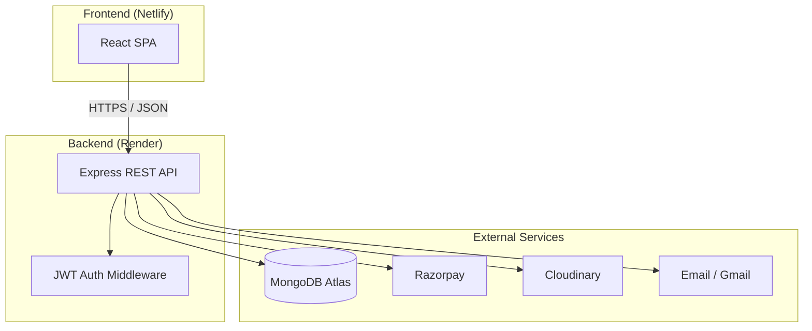

# Crosia by Hand

**Online E-Commerce Platform for Handmade Woollen Crochet Products**

> *Every loop made with love.*

---

## Table of Contents

- [Overview](#overview)
- [Problem Statement](#problem-statement)
- [Objectives](#objectives)
- [Tech Stack](#tech-stack)
- [Features](#features)
- [System Architecture](#system-architecture)
- [Project Structure](#project-structure)
- [Getting Started](#getting-started)
- [Environment Variables](#environment-variables)
- [Database Schema](#database-schema)
- [API Reference](#api-reference)
- [User Roles & Routes](#user-roles--routes)
- [Payment Flow](#payment-flow)
- [Deployment](#deployment)
- [Security](#security)
- [Limitations & Future Scope](#limitations--future-scope)
- [Credits](#credits)
- [Repository](#repository)

---

## Overview

**Crosia by Hand** is a full-stack e-commerce web application built as a capstone project. It enables a small handmade crochet business to showcase products, accept orders from customers across India, and manage inventory and fulfilment through an admin dashboard.

The platform supports user authentication, a server-backed shopping cart, online payments via Razorpay (with Cash on Delivery fallback), product reviews, and optional email notifications for order updates.

| Detail | Value |
|--------|-------|
| **Currency** | INR (₹) |
| **Target market** | India (10-digit phone, 6-digit pincode validation) |
| **Frontend** | React SPA hosted on Netlify |
| **Backend** | REST API hosted on Render |
| **Database** | MongoDB Atlas |

---

## Problem Statement

Artisans and small handmade businesses often lack an affordable, easy-to-manage online storefront. Generic marketplaces charge high commissions and offer limited branding. This project addresses the need for a dedicated, lightweight e-commerce solution tailored to a crochet business — with product categorisation, secure checkout, order tracking, and admin tools — without the complexity of enterprise platforms.

---

## Objectives

1. Build a responsive, user-friendly storefront for browsing and purchasing handmade crochet products.
2. Implement secure user registration, login, and role-based access (customer vs. admin).
3. Provide a server-backed shopping cart and checkout flow with Indian address validation.
4. Integrate Razorpay for online payments, with COD as a fallback when payment keys are not configured.
5. Offer an admin panel for product CRUD, image upload, and order status management.
6. Enable customer product reviews with verified-purchase badges.
7. Deploy the application using modern cloud services (Netlify, Render, MongoDB Atlas).

---

## Tech Stack

| Layer | Technology | Hosting |
|-------|------------|---------|
| **Frontend** | React 19, Vite 8, React Router 7 | [Netlify](https://www.netlify.com/) (`client/`) |
| **Backend** | Node.js 18+, Express 5 | [Render](https://render.com/) (`server/`) |
| **Database** | MongoDB with Mongoose 9 | [MongoDB Atlas](https://www.mongodb.com/atlas) |
| **Payments** | Razorpay SDK (optional) | — |
| **Image storage** | Cloudinary (optional admin upload) | Cloudinary folder `crosia_by_hand` |
| **Email** | Nodemailer + Gmail (optional) | — |
| **Auth** | JWT (7-day tokens), bcrypt password hashing | — |
| **Linting** | oxlint (client) | — |

---

## Features

### Customer

- Browse products by category (`Decor`, `Storage`, `Living`, `Wear & Carry`) with search
- View product details, stock status, and average ratings
- Register, log in, and reset password (demo mode returns reset link in API response)
- Server-persisted shopping cart with quantity controls
- Checkout with shipping details (Indian phone & pincode validation)
- Pay via **Razorpay** or **Cash on Delivery**
- View order history and order confirmation page
- Submit and manage product reviews (one per user per product)
- Verified purchase badge on reviews when the user has ordered that product

### Admin

- Create, update, and delete products
- Upload product images to Cloudinary (when configured)
- View all customer orders
- Update order status (`created`, `paid`, `failed`, `cod_pending`, `shipped`, `delivered`)
- Optional email notifications on shipped/delivered status

---

## System Architecture



**Data flow (typical purchase):**

1. Customer adds items to cart → stored in MongoDB linked to user ID.
2. At checkout, server builds order from DB cart (totals computed server-side).
3. Razorpay modal opens (if configured) or COD order is created.
4. On successful payment, order status updates and cart is cleared.
5. Optional confirmation/status emails are sent via Nodemailer.

---

## Project Structure

```
capstone_project/
├── client/                     # React frontend (Netlify publish: client/dist)
│   ├── public/products/        # Local-only photos (gitignored); prod uses Cloudinary
│   ├── src/
│   │   ├── api.js              # Central API client (fetch + Bearer token)
│   │   ├── App.jsx             # Routes + PrivateRoute / AdminRoute guards
│   │   ├── context/            # AuthContext, CartContext
│   │   ├── components/         # Layout, ProductCard, StarRating, ProductReviews
│   │   └── pages/              # Home, Shop, Cart, Checkout, Orders, admin/*
│   └── .env.example
├── server/                     # Express backend (Render)
│   └── src/
│       ├── index.js            # App entry, CORS, route mounting
│       ├── models/             # User, Product, Cart, Order, Review
│       ├── routes/             # auth, products, cart, orders, upload
│       ├── middleware/         # JWT protect + adminOnly
│       ├── config/             # db, cloudinary, mailer
│       └── utils/              # orderEmail
│   └── .env.example
├── docs/
│   └── image-credits.md
├── netlify.toml                # SPA redirect + build config
└── README.md
```

---

## Getting Started

### Prerequisites

- **Node.js** 18 or higher
- **npm**
- **MongoDB Atlas** account (free tier works)
- (Optional) Razorpay, Cloudinary, and Gmail credentials for full feature set

### 1. Clone the repository

```bash
git clone https://github.com/dam-8727/crosia_by_hand.git
cd crosia_by_hand
```

### 2. Backend setup

```bash
cd server
cp .env.example .env
# Edit .env — set MONGODB_URI, JWT_SECRET, and CLIENT_URL
npm install
npm run dev
```

The API runs at **http://localhost:5001** by default.

### 3. Frontend setup

Open a second terminal:

```bash
cd client
cp .env.example .env
# Edit .env — set VITE_API_URL=http://localhost:5001
npm install
npm run dev
```

Open **http://localhost:5173** in your browser.

### 4. Seed products (optional)

```bash
cd server
npm run seed
```

This populates the database with ~40 products. **Product photos are not in Git** — place image files in `client/public/products/` on your machine before seeding (see that folder’s README). Production uses Cloudinary URLs from MongoDB.

### 5. Create an admin user

1. Register a new account via the frontend (`/register`).
2. Promote that user to admin:

```bash
cd server
npm run make-admin -- user@example.com
```

Log in again to access `/admin/products` and `/admin/orders`.

---

## Environment Variables

### Server (`server/.env`)

| Variable | Required | Description |
|----------|----------|-------------|
| `PORT` | No | Server port (default: `5001`) |
| `MONGODB_URI` | **Yes** | MongoDB Atlas connection string |
| `JWT_SECRET` | **Yes** | Secret for signing JWT tokens |
| `CLIENT_URL` | **Yes** | Comma-separated CORS origins (e.g. `http://localhost:5173,https://your-app.netlify.app`) |
| `NODE_ENV` | No | `development` or `production` |
| `RAZORPAY_KEY_ID` | No | Razorpay key — if both Razorpay vars are set, online checkout is enabled |
| `RAZORPAY_KEY_SECRET` | No | Razorpay secret |
| `CLOUDINARY_CLOUD_NAME` | No | All three Cloudinary vars enable admin image upload |
| `CLOUDINARY_API_KEY` | No | Cloudinary API key |
| `CLOUDINARY_API_SECRET` | No | Cloudinary API secret |
| `EMAIL_USER` | No | Gmail address — if both email vars are set, order emails are sent |
| `EMAIL_PASS` | No | Gmail app password |

### Client (`client/.env`)

| Variable | Required | Description |
|----------|----------|-------------|
| `VITE_API_URL` | **Yes** | Backend base URL (default: `http://localhost:5001`) |

---

## Database Schema

### User
- `name`, `email` (unique), `passwordHash`, `role` (`customer` | `admin`)
- Password reset: `resetTokenHash`, `resetTokenExpiry` (15 min)

### Product
- Categories: `Decor`, `Storage`, `Living`, `Wear & Carry`
- Auto-generated unique `slug` from product name
- Fields: `name`, `category`, `price`, `description`, `color`, `material`, `stock`, `imageUrl`, `rating`, `numReviews`
- Text index on name, description, and category

### Cart
- One cart per user (unique user reference)
- Items: `{ product, qty }` — populated on read

### Order
- Line items snapshotted at purchase time (name, price, qty, imageUrl)
- Shipping: `fullName`, `phone`, `address`, `city`, `pincode`
- Payment method: `razorpay` or `cod`
- Status: `created`, `paid`, `failed`, `cod_pending`, `shipped`, `delivered`

### Review
- One review per user per product (compound unique index)
- Fields: `product`, `user`, `name`, `rating` (1–5), `comment`, `verified`
- `verified` is `true` when the user has a qualifying order containing the product

---

## API Reference

Base URL: `/api`

### Auth — `/api/auth`

| Method | Endpoint | Auth | Description |
|--------|----------|------|-------------|
| POST | `/register` | — | Register new user; returns JWT |
| POST | `/login` | — | Login; returns JWT |
| GET | `/me` | JWT | Current user profile |
| POST | `/forgot` | — | Request password reset (demo: link in response) |
| POST | `/reset` | — | Reset password with token |

Rate limit: 30 requests per 15 minutes.

### Products — `/api/products`

| Method | Endpoint | Auth | Description |
|--------|----------|------|-------------|
| GET | `/` | — | List products (`?category=`, `?search=`) |
| GET | `/:slug` | — | Single product by slug |
| GET | `/:slug/reviews` | — | Product reviews (newest first) |
| POST | `/:slug/reviews` | JWT | Create/update user's review |
| DELETE | `/:slug/reviews` | JWT | Delete own review |
| POST | `/` | Admin | Create product |
| PUT | `/:id` | Admin | Update product |
| DELETE | `/:id` | Admin | Delete product |

### Cart — `/api/cart` (JWT required)

| Method | Endpoint | Body |
|--------|----------|------|
| GET | `/` | — |
| POST | `/` | `{ productId, qty }` |
| PUT | `/:productId` | `{ qty }` (qty ≤ 0 removes item) |
| DELETE | `/:productId` | — |

### Orders — `/api/orders` (JWT required)

| Method | Endpoint | Description |
|--------|----------|-------------|
| GET | `/config` | `{ razorpayEnabled, keyId }` |
| POST | `/create` | Create order from cart `{ shipping }` |
| POST | `/verify` | Verify Razorpay payment signature |
| GET | `/` | User's orders |
| GET | `/:id` | Single order (own orders only) |
| GET | `/admin/all` | Admin: all orders |
| PATCH | `/admin/:id/status` | Admin: update order status |

### Upload — `/api/upload` (Admin + Cloudinary)

| Method | Endpoint | Description |
|--------|----------|-------------|
| POST | `/` | Multipart field `image`, max 5 MB → returns `{ url }` |

---

## User Roles & Routes

### Frontend routes

| Path | Access | Page |
|------|--------|------|
| `/` | Public | Home — hero, categories, featured products |
| `/shop` | Public | Product listing with filter & search |
| `/product/:slug` | Public | Product detail + reviews |
| `/login`, `/register` | Public | Authentication |
| `/forgot-password`, `/reset-password` | Public | Password reset |
| `/cart`, `/checkout`, `/orders` | Private | Shopping flow |
| `/order-success/:id` | Private | Order confirmation |
| `/admin/products`, `/admin/orders` | Admin | Product & order management |

### Authentication

- JWT stored in `localStorage` under key `crosia_token`
- Sent as `Authorization: Bearer <token>` on protected requests
- `PrivateRoute` redirects unauthenticated users to `/login`
- `AdminRoute` redirects non-admin users to `/`

---

## Payment Flow

1. Customer submits shipping form on **Checkout**.
2. `POST /api/orders/create` builds the order from the database cart (server-side totals).
3. **If Razorpay keys are configured:**
   - Creates a Razorpay order and a pending Order (`status: created`).
   - Opens the Razorpay checkout modal.
   - On success → `POST /api/orders/verify` → `status: paid`, cart cleared.
4. **If Razorpay is not configured:**
   - Creates a COD order (`status: cod_pending`), cart cleared immediately.
5. Customer is redirected to `/order-success/:id`.

---

## Deployment

This project uses a **monorepo** with separate deploy targets:

| Service | Directory | Notes |
|---------|-----------|-------|
| **Netlify** | `client/` | Build command: `npm run build`, publish: `client/dist`. SPA fallback configured in `netlify.toml`. |
| **Render** | `server/` | Start command: `npm start`. Set all server env vars in Render dashboard. |
| **MongoDB Atlas** | — | Whitelist Render's IP or use `0.0.0.0/0` for development/demo. |

**Production checklist:**

1. Set `VITE_API_URL` on Netlify to your Render API URL.
2. Set `CLIENT_URL` on Render to include your Netlify URL (comma-separated if multiple).
3. Configure `MONGODB_URI` and `JWT_SECRET` on Render.
4. (Optional) Add Razorpay, Cloudinary, and email credentials.

Local development CORS is always allowed for `http://localhost:5173`.

---

## Security

- **Helmet** HTTP security headers on Express
- **bcrypt** (12 rounds) for password hashing
- **JWT** authentication with 7-day expiry
- **Rate limiting** on auth routes and review writes
- Password reset tokens stored as SHA-256 hashes
- Forgot-password endpoint always returns success (prevents email enumeration)
- Order totals computed server-side from DB — client amounts are never trusted
- Role-based middleware (`protect`, `adminOnly`) on sensitive routes

---

## Limitations & Future Scope

### Current limitations

- Password reset runs in demo mode (reset link returned in API response, not emailed)
- Stock is not decremented automatically on order placement
- No admin moderation for product reviews
- No pagination on product, review, or order lists

### Planned enhancements

- Full email-based password reset flow
- Inventory management with stock decrement on purchase
- Admin review moderation
- Pagination and advanced filtering
- Order cancellation and refund support
- Analytics dashboard for admin

---

## Credits

- Product photographs are original handmade crochet work — **excluded from this repository** to protect designs. Production images are served from Cloudinary. See [docs/image-credits.md](docs/image-credits.md).
- Brand: **Crosia by Hand**

---

## Repository

**GitHub:** [https://github.com/dam-8727/crosia_by_hand.git](https://github.com/dam-8727/crosia_by_hand.git)

---

## NPM Scripts

### Server (`server/`)

| Script | Command |
|--------|---------|
| `npm run dev` | Start with file watch |
| `npm start` | Production start |
| `npm run seed` | Seed ~40 products with real photos |
| `npm run make-admin -- <email>` | Promote user to admin |

### Client (`client/`)

| Script | Command |
|--------|---------|
| `npm run dev` | Vite dev server (port 5173) |
| `npm run build` | Production build → `dist/` |
| `npm run lint` | Run oxlint |
| `npm run preview` | Preview production build locally |

---

*Built as a capstone project — Crosia by Hand © 2026*
